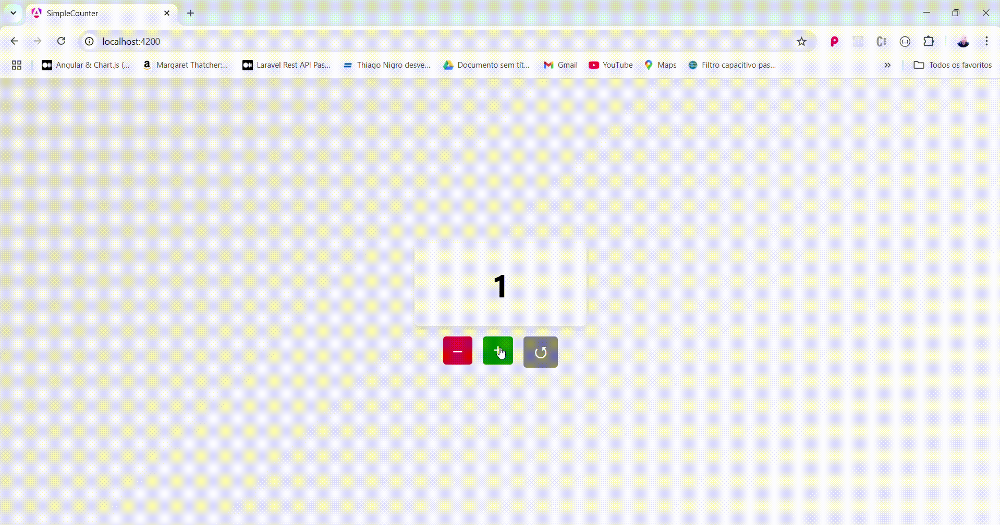

# 🧮 Simple Counter with Angular

> Basic project, but with important concepts, to practice modern Angular features such as Signals, Standalone Components, @Input(), @Output() and Data Binding.



## 📌 What is it

Application developed in Angular with a focus on learning and exploring:

- 🧠 Modern reactivity with Signals
- ⚙️ Reusable components
- 📥 Parent → Child communication with input
- 📤 Child → Parent communication with output
- 🎨 SCSS for custom styling
- 🌿 Standalone Components (without NgModules)

## 🎯 Features

- Centered card displaying the current value of the counter
- Three buttons: Increment, Decrement and Reset
- Each button is a reusable component with communication via events
- Visually pleasing application with **background gradient**, centered and responsive layout

## ✅ Automated Testing

The project includes a complete suite of unit tests using **Jasmine** and **TestBed** to ensure that all components behave correctly.

- 🔘 **Button Component**
  - Checks if the correct label and color is rendered based on the type
  - Verifies event emission with `output()` on button click

- 📦 **Card Component**
  - Validates if the correct count is displayed via `input()` binding

- 🧩 **App Component**
  - Simulates user interactions by clicking buttons
  - Verifies the logic for incrementing, decrementing and resetting the counter
  - Confirms that data flows correctly between parent and child components

> Run tests with:
```bash
ng test
```

## 🖥️ Access the Demo Here

👉 [https://jordan-will.github.io/angular-simple-counter/](https://jordan-will.github.io/angular-simple-counter/)

## 🚀 How to Run Locally

```bash
download https://jordan-will.github.io/angular-simple-counter/
cd angular-simple-counter
npm install
ng serve
```